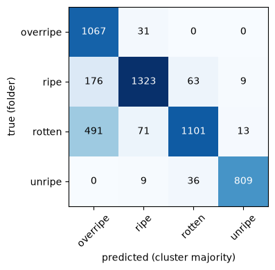
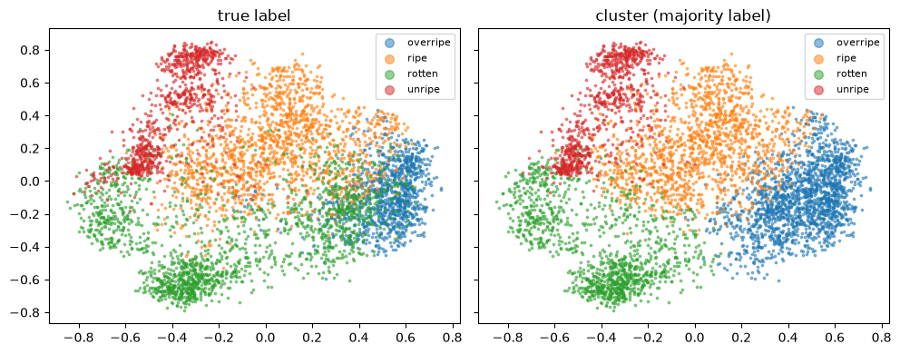

# Banana Ripeness: Unsupervised Clustering

Groups banana photos into 4 ripeness classes (**unripe / ripe / overripe / rotten**) **without using labels for training**. Labels are only used afterwards to evaluate the clusters.

Dataset: [Banana Ripeness Classification Dataset](https://www.kaggle.com/datasets/shahriar26s/banana-ripeness-classification-dataset) (Kaggle, 13,478 images).

## Result

| acc | NMI | ARI | recall overripe | recall ripe | recall rotten | recall unripe |
|---|---|---|---|---|---|---|
| 0.827 | 0.637 | 0.590 | 0.972 | 0.842 | 0.657 | 0.947 |

Accuracy uses majority vote: each cluster is named after the most common true label inside it.

| Confusion matrix | Clusters in 2D (PCA) |
|---|---|
|  |  |

## Method

1. **Clean the data.** The Kaggle train split contains 3 augmented copies of each photo, and some photos appear in several splits or under two labels. We pool all splits, group copies by UUID and near-identical pixels (dHash), drop photos with conflicting labels and keep one image per photo: 13,478 → **5,199** images.
2. **Remove backgrounds** with `rembg` (`u2netp`), since backgrounds differ strongly between sources.
3. **Features.**
   - **DINOv3 ViT-S+/16** CLS token (384-d, self-supervised) → PCA to 64-d: shape, texture and damage.
   - **Colour histogram** (hue / saturation / brightness) over banana pixels only (40-d): ripeness stage.
   - Both blocks are L2-normalised and concatenated, with colour weighted by `w = 0.4`.
4. **KMeans**, `k = 4`.

## Two notebooks

The two notebooks contain the same pipeline and the same results; they only differ in where DINOv3 is loaded from.

| Notebook | DINOv3 source | Use it when |
|---|---|---|
| `banana-pipeline-final-dist.ipynb` | Official weights from Hugging Face, loaded with `transformers` (needs `HF_TOKEN`) | **Running it yourself.** Setup below |
| `banana-pipeline-final.ipynb` | Local `torch.hub` cache (DINOv3 repo + `.pth` checkpoints in `~/.cache/torch/hub`) | The original development run; needs the checkpoints downloaded manually |

## Notebook layout

| Section | Content |
|---|---|
| 0. Setup | imports, config, helpers |
| 1. EDA | class balance, augmentation copies, leakage, filename prefix vs label, backgrounds |
| 2. Prep | pooling, deduplication, label-conflict removal, background removal |
| 3. Main model | features + KMeans (no labels used) |
| 4. Validation | metrics, error analysis, ablations, hyperparameter sweeps, alternative backbones / clusterers, attempts to fix `rotten` |
| Conclusions | findings, choices, rejected alternatives, limitations |

## Setup

1. **Install** (Python 3.10+; a CUDA GPU is recommended but not required):
   ```bash
   pip install -r requirements.txt
   ```
   For GPU background removal, install `onnxruntime-gpu` instead of `onnxruntime`.
2. **Get access to DINOv3.** The weights are gated on Hugging Face. While logged in, open both pages and accept the licence:
   - https://huggingface.co/facebook/dinov3-vits16plus-pretrain-lvd1689m (main model)
   - https://huggingface.co/facebook/dinov3-vitb16-pretrain-lvd1689m (§4.5.1 comparison only)
3. **Add your token.** Create a read token at https://huggingface.co/settings/tokens, then:
   ```bash
   cp .env.example .env
   # edit .env: HF_TOKEN=hf_...
   ```
   `.env` is git-ignored; never commit it.

The Kaggle dataset is public and downloads automatically; no Kaggle account is needed.

## Run

Open `banana-pipeline-final-dist.ipynb` and run all cells (Jupyter: *Restart & Run All*). The first run downloads the dataset, the models and removes backgrounds for 5,199 images; later runs reuse the cached files in `work/`.

## Files

| Path | What |
|---|---|
| `banana-pipeline-final-dist.ipynb` | the full pipeline, DINOv3 from Hugging Face |
| `banana-pipeline-final.ipynb` | the same pipeline, DINOv3 from a local `torch.hub` cache |
| `assets/` | figures exported from the notebook |
| `requirements.txt` | Python dependencies |
| `.env.example` | template for `.env` (Hugging Face token) |
